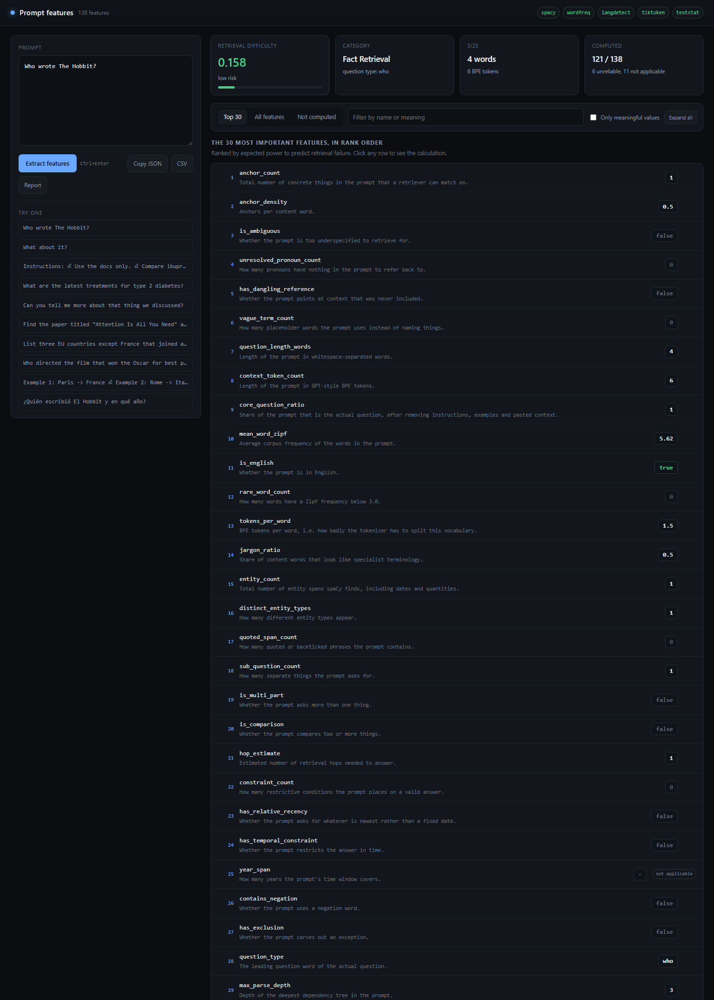
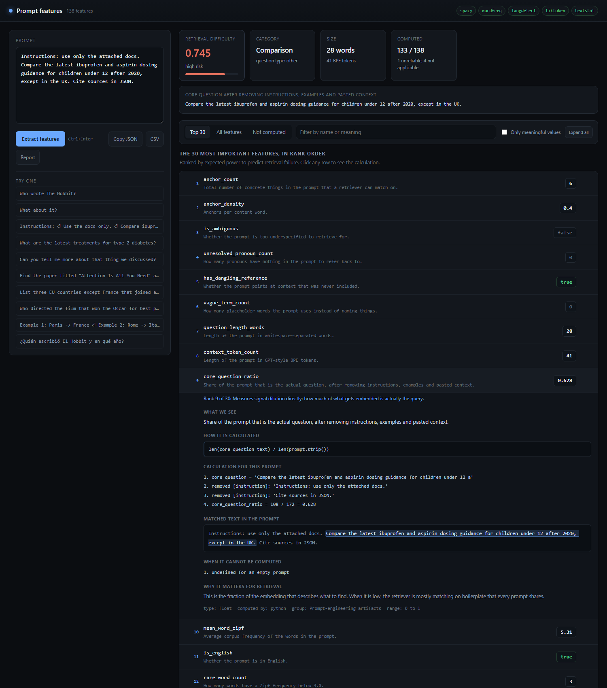

# Prompt features

Turn a single prompt into **138 measurable features** that describe how hard it
will be to retrieve for — before any retrieval happens.

Everything is computed from the prompt text alone: no model name, no retrieved
documents, no gold answer. That makes the output usable as input to a retrieval
failure predictor, as a triage signal in front of a RAG pipeline, or as a way to
sort an evaluation set by expected difficulty.

Every feature has to satisfy one rule:

> If this value is high or true, retrieval is more likely to fail, because ...

**Try it: [prompt-features.onrender.com](https://prompt-features.onrender.com/)**
— type a prompt and click any feature to see how its value was reached. It is on
a free instance, so the first load after a quiet period takes a moment to wake.



## Why prompt-only features

A retrieval failure is usually decided before the retriever runs. The query is
vague, or it asks three things at once, or it says "the attached docs" and names
nothing searchable, or it buries eight words of question in two hundred words of
instructions. These are properties of the prompt, and they can be measured
cheaply and deterministically.

The features are grouped by the failure mode they detect:

| group | features | what it catches |
| --- | --- | --- |
| Retrieval anchors | 23 | names, numbers, quotes and identifiers to match on |
| Readability and lexical difficulty | 17 | how hard the wording is, how varied the vocabulary |
| Size and shape | 15 | how much text the retriever has to work with |
| Question structure | 15 | what kind of ask it is, and how many asks it contains |
| Prompt-engineering artifacts | 15 | instruction and example scaffolding around the question |
| Reasoning and multi-hop | 13 | whether answering needs several documents combined |
| Ambiguity and underspecification | 10 | whether the prompt says enough to be answerable |
| Temporal constraints | 9 | how the answer is restricted in time |
| Domain and register | 9 | subject area, language, politeness noise |
| Rarity and vocabulary | 7 | whether the corpus is likely to use these words at all |
| Composite risk scores | 5 | blends of the above, with every term shown |

## Every number can be audited

The point of the tool is not the numbers, it is being able to check them. Click
any feature to see the formula, the arithmetic with this prompt's values
substituted in, the exact text that matched highlighted in place, the conditions
under which the feature cannot be computed, and why it predicts retrieval
failure.



## Running it locally

Requires Python 3.10 or newer.

```bash
python -m venv venv
source venv/bin/activate          # Windows: .\venv\Scripts\activate
pip install -r requirements.txt
python app.py
```

That installs the spaCy English model too, and opens
`http://127.0.0.1:8765`. The install is around 400 MB, most of it spaCy and
wordfreq data.

If a backend is missing, the features that depend on it report status
`unavailable` with an install hint instead of failing, and the other 100+
features still work.

## The three ways to use it

### Web interface

```bash
python app.py                     # http://127.0.0.1:8765
python app.py --port 9000 --no-browser
```

Runs on the Python standard library, so there is no frontend build step. Values
export as JSON or CSV, and the full calculation trace exports as Markdown.

A view can be shared as a link: `?prompt=` fills the box and runs it, `?open=`
expands named features, `?view=` picks a tab (`top`, `all`, `issues`).

```
http://127.0.0.1:8765/?prompt=Who%20wrote%20The%20Hobbit%3F&open=core_question_ratio
```

### Python

```python
from features import extract_features, extract_top_features

extract_features("Who wrote The Hobbit?")            # all 138
extract_top_features("Who wrote The Hobbit?")        # the 30 ranked ones
extract_features("Who wrote The Hobbit?", with_status=True)
```

### Command line

```bash
python features.py "Who wrote The Hobbit?"           # ranked report
python features.py --json "Who wrote The Hobbit?"    # values as JSON
python explain.py "Who wrote The Hobbit?"            # full report into reports/
```

## Running it on a dataset

Batch work runs locally, not through the hosted app: one process handles one
prompt at a time, so a large upload would block everyone else on the URL.

```bash
python enrich.py --input mine.csv --output out.csv --top30 --with-status
```

The input needs one column of prompt text, named `question` by default. Every
other column is passed through untouched, so labels and ids stay attached to
their row.

| flag | default | effect |
| --- | --- | --- |
| `--input` | `data/example_prompts.csv` | CSV to read |
| `--output` | `data/example_prompts_enriched.csv` | CSV to write |
| `--column` | `question` | which column holds the prompt text |
| `--top30` | off | write only the 30 ranked features instead of all 138 |
| `--with-status` | off | add `<name>__status` and `<name>__reason` per feature |

Run it with no arguments to try it on the 20 bundled example prompts.

**Reading the output.** A blank cell is not a zero, it is a feature that could
not be honestly computed for that row. `--with-status` puts the reason in the
CSV next to it, which is worth doing on a first pass:

```python
import pandas as pd

df = pd.read_csv("out.csv")
df["year_span"].isna().sum()                       # how many rows lack a year
df.loc[df["year_span"].isna(), "year_span__reason"].value_counts()
```

Without `--with-status`, the script still prints a summary of which features
were blank and for how many rows, so nothing is silently missing.

**What to expect.** About 150 ms per prompt after a five-second model load, so
roughly 5 000 prompts per hour in one single-threaded process. Memory stays flat
at around 350 MB regardless of dataset size, since rows are processed one at a
time. For a much larger corpus, split the file and run several processes, or
import `enrich()` from `enrich.py` and parallelise over chunks.

**As a library**, if you would rather not go through CSV:

```python
from enrich import enrich
import pandas as pd

out = enrich(pd.read_csv("mine.csv"), "prompt_text", top30=True, with_status=True)
```

## A missing value is never zero

A feature that cannot be honestly computed returns `None` with a status and a
reason, rather than a `0` that a model would read as a real measurement.

| status | meaning |
| --- | --- |
| `ok` | computed normally |
| `not_applicable` | the prompt has nothing of this kind, e.g. `year_span` when no year is mentioned |
| `undefined` | the formula has no value, e.g. a ratio whose denominator is 0 |
| `unreliable` | computed, but outside the range where the metric means anything, e.g. Flesch-Kincaid on four words |
| `unavailable` | the backend it needs is not installed |

`with_status=True` adds `<name>__status` and `<name>__reason` alongside each
value, so the reason travels with the data.

## The 30 that matter most

All 138 are computed, and 30 are ranked by expected power to predict retrieval
failure, chosen to cover distinct failure modes with as little redundancy as
possible. The first ten:

| rank | feature | why it earns the rank |
| --- | --- | --- |
| 1 | `anchor_count` | Zero anchors means the retriever has no specific target at all; the strongest single signal. |
| 2 | `anchor_density` | Normalises the anchor count so long prompts cannot fake specificity. |
| 3 | `is_ambiguous` | The headline underspecification flag, a composite rather than a word-count threshold. |
| 4 | `unresolved_pronoun_count` | A dangling pronoun means the information need is literally not in the text. |
| 5 | `has_dangling_reference` | Names a context dependency that no retrieval over a corpus can satisfy. |
| 6 | `vague_term_count` | Placeholders mark exactly the words a retriever cannot match on. |
| 7 | `question_length_words` | The cheapest proxy for how many distinct needs are packed into one query. |
| 8 | `context_token_count` | The retriever embeds tokens, not words, so tokens are the true query size. |
| 9 | `core_question_ratio` | Measures signal dilution: how much of what gets embedded is actually the query. |
| 10 | `mean_word_zipf` | A real frequency measurement of whether the corpus uses these words at all. |

[FEATURES.md](FEATURES.md) documents all 138 in the same shape, and lists the
full ranked 30 with the reason each earned its place.

## Adding or changing a feature

Feature declarations are the single source of truth. A feature is one decorated
function that returns a value together with the steps that produced it:

```python
@register(
    "rare_word_count",
    group="rarity",
    dtype="int",
    summary=f"How many words have a Zipf frequency below {RARE_ZIPF}.",
    formula=f"count(wordfreq.zipf_frequency(word, 'en') < {RARE_ZIPF})",
    why="Rare words are the ones an embedding model has seen least and a "
        "keyword index is least likely to contain verbatim.",
    backend="wordfreq",
    value_range=">= 0",
    status_rules=["unavailable when wordfreq is not installed"],
    example="Compare ibuprofen and aspirin for fever in children after 2020. What dose is safe?",
    expected=1,
    tier=1,
    rank=12,
    rank_reason="Counts the specific terms most likely to be absent from the index.",
)
def rare_word_count(doc, ctx):
    words, scores = _scored_words(doc)
    if words is None:
        return unavailable("wordfreq")          # status, not a silent zero
    rare = [w for w in words if scores[w.lower] < RARE_ZIPF]
    return ok(
        len(rare),
        f"words below Zipf {RARE_ZIPF}: {...}",  # the trace shown in the UI
        spans=[span(w.start, w.end, "rare word") for w in rare],
    )
```

Everything else follows from that declaration: the value, the web UI card, the
Markdown report, the row in `FEATURES.md`, and a test asserting that the
documented example still returns the documented value.

```bash
python build_docs.py                  # regenerate FEATURES.md
python -m unittest discover tests     # 51 tests, 3891 subtests
python tests/smoke_api.py             # every HTTP route, needs app.py running
```

Documentation and code cannot drift apart silently: the test suite re-checks
every documented example against the implementation.

## Performance

Measured on one machine, Python 3.10, all backends loaded:

| | |
| --- | --- |
| Cold start, loading spaCy | 5.0 s, once per process |
| Typical prompt (under 200 chars) | 35 ms |
| 20 000-char prompt | 1.9 s |
| Steady memory | 326 MB in the Docker container |

Cost is linear in prompt length. Hosted deployments cap the prompt at
`MAX_PROMPT_CHARS` (default 20 000) so one large paste cannot tie up the server.

## Deployment

Live at **[prompt-features.onrender.com](https://prompt-features.onrender.com/)**,
running on Render from `render.yaml` in this repo. A push to `main` redeploys.

The instance is on Render's free tier, which sleeps after inactivity, so the
first request after a quiet period waits for a cold start. Warm it with one
request before a demo.

To run the same image anywhere else:

```bash
docker build -t prompt-features .
docker run -p 8765:8765 prompt-features
```

| variable | default | purpose |
| --- | --- | --- |
| `PORT` | `8765` | port to bind; most hosts set this |
| `HOST` | `127.0.0.1` | must be `0.0.0.0` when hosted |
| `MAX_PROMPT_CHARS` | `20000` | longest prompt accepted |

## HTTP API

| route | returns |
| --- | --- |
| `GET /api/schema` | all 138 declarations, no prompt needed |
| `GET /api/health` | which backends loaded, with versions |
| `POST /api/explain` | `{"prompt": "..."}` to values plus calculation traces |
| `POST /api/report` | `{"prompt": "..."}` to the Markdown report as text |

## Layout

```
features.py            public API: extract_features, extract_top_features
app.py                 stdlib web server for the UI and the API
explain.py             per-prompt Markdown calculation report
enrich.py              add feature columns to a CSV
build_docs.py          generate FEATURES.md from the registry
promptfeat/
  registry.py          Feature, FeatureResult, statuses, @register
  doc.py               PromptDoc: one shared analysis pass per prompt
  lexicons.py          named word lists, so evidence can cite what matched
  nlp.py               lazy spaCy / wordfreq / langdetect / tiktoken loaders
  engine.py            dependency-ordered computation and explanation
  f_size.py            size and shape
  f_lexical.py         readability and lexical diversity
  f_rarity.py          word frequency and vocabulary mismatch
  f_structure.py       question shape and number of asks
  f_anchors.py         entities, numbers, quotes, identifiers
  f_temporal.py        time constraints
  f_reasoning.py       negation, comparison, multi-hop depth
  f_ambiguity.py       underspecification
  f_domain.py          category, domain, language
  f_promptcraft.py     instruction and few-shot scaffolding
  f_composite.py       blended risk scores
web/                   the UI, no build step
tests/                 formula, example, regression and adversarial tests
```

## Known limits

**The composite weights are reasoned, not fitted.** `retrieval_difficulty_score`
combines seven failure modes with a noisy-OR, and its weights are a judgement
call because no labelled retrieval-failure data exists for this project yet.
They live in `promptfeat/f_composite.py` and are meant to be replaced once
labels exist. The per-mode contributions are shown in every trace precisely so
they can be regressed against real outcomes later.

**The language term assumes an English index.** A non-English prompt is scored
as higher risk. Drop that term if the corpus is multilingual.

**Lexicons are English.** Negation, vagueness, temporal and task-verb detection
use curated English word lists, visible in `promptfeat/lexicons.py`.
